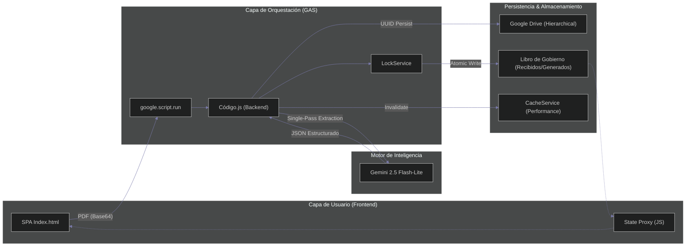
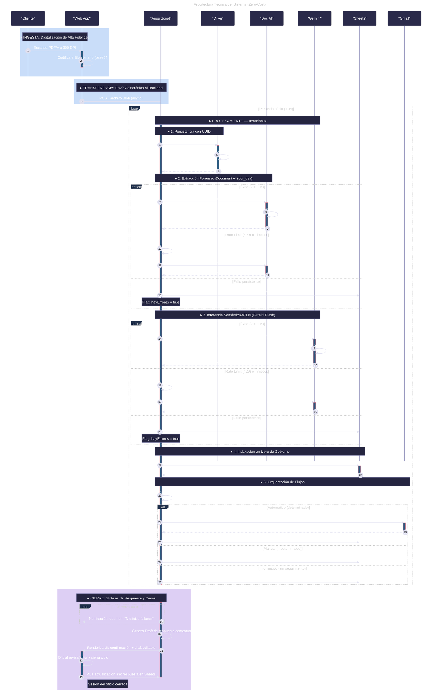
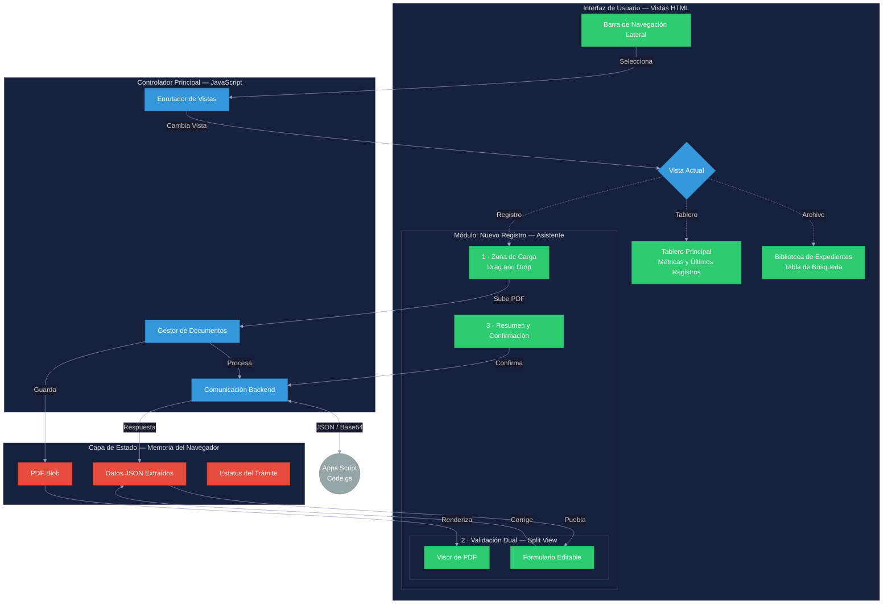

# 🚀 División de Servicios Administrativos (DSA)
### **Sistema de Gestión Documental Inteligente | Enterprise-Grade Automation**

---

## 💎 Visión General
El ecosistema **DSA (División de Servicios Administrativos)** redefine la gestión documental institucional mediante una arquitectura de **IA Multimodal de vanguardia**. A diferencia de los sistemas tradicionales de OCR secuencial, el DSA utiliza el motor **Gemini 2.5 Flash-Lite** para realizar la extracción de texto y el razonamiento semántico en un **único paso atómico**, garantizando una latencia mínima y una precisión forense sin costos de infraestructura de servidor (Zero-Cost Infrastructure).

### 🌟 Pilares de Alta Ingeniería
*   **🧠 Extracción Multimodal**: Procesamiento nativo de archivos PDF mediante `inline_data`, eliminando la necesidad de capas intermedias de OCR.
*   **⚡ Reactividad con Estado (Proxy-based)**: Frontend SPA construido con un patrón de **Reactive Proxy** para la gestión de estado local sincronizada.
*   **🛡️ Robustez Transaccional**: Implementación de reintentos exponenciales y `LockService` para garantizar la integridad en entornos multiusuario de alta concurrencia.
*   **📝 Redacción Asistida**: Generación de respuestas oficiales profesionalizadas mediante modelos de lenguaje integrados en el flujo de trabajo.

---

## 🛠️ Stack Tecnológico de Elite

| Capa | Componente | Implementación Técnica |
| :--- | :--- | :--- |
| **Core Engine** | Apps Script (V8) | Orquestación serverless de alta disponibilidad. |
| **Inteligencia** | Gemini 2.5 Flash-Lite | Extracción de metadatos (titular, área, asunto, prioridad). |
| **Frontend UI** | HTML5 / CSS3 / JS | Estética **Apple/MacOS Native** con Glassmorphism y Dark Mode. |
| **Data Layer** | Google Sheets & Drive | Persistencia atómica y organización jerárquica Year/Month/Day. |
| **Optimización** | CacheService | Capa de caché para métricas de Dashboard y consultas a Biblioteca. |
| **Seguridad** | PropertiesService | Gestión segura de API Keys y parámetros de entorno. |

---

## 🏗️ Arquitectura Técnica

### **Evolución: Flujo Multimodal Atómico (Actual)**
La implementación actual optimiza el pipeline eliminando la dependencia de Document AI, consolidando toda la inteligencia en una única llamada multimodal a Gemini.

### **Diagrama de Secuencia de Referencia (Legacy/Híbrido)**
*Este diagrama representa la arquitectura base del flujo de trabajo institucional.*

---

## 🎨 Ecosistema Frontend (MacOS Native SPA)
La interfaz de usuario ha sido concebida bajo principios de **Diseño Atómico** y estética MacOS, proporcionando una experiencia fluida que minimiza la carga cognitiva.

### **Gestión de Estado Reactiva**
El sistema implementa un objeto `AppState` basado en **JavaScript Proxies**, permitiendo que la UI se actualice automáticamente ante cambios en los datos extraídos o el estado del procesamiento.

---

## ⚡ Características de Alta Ingeniería
1.  **Redacción Profesional Asistida**: Módulo integrado que utiliza Gemini para transformar notas rápidas del usuario en oficios de respuesta formales y jurídicamente estructurados.
2.  **Validación Dual Atómica**: Interfaz de "Split View" que garantiza que los datos indexados coincidan exactamente con la fuente forense (PDF original).
3.  **Caché de Alto Rendimiento**: Implementación de `CacheService` con expiración inteligente para servir métricas de Dashboard en <200ms.
4.  **Resiliencia Exponencial**: Algoritmos de backoff en llamadas a APIs externas para mitigar errores de `Rate Limit` (HTTP 429).

---

## 🛡️ Seguridad y Gobierno de Datos
*   **Aislamiento de Secretos**: Todas las credenciales se gestionan vía `PropertiesService`, evitando fugas de información en el código fuente.
*   **Control de Concurrencia**: Uso de `LockService.getScriptLock()` para prevenir colisiones en el Libro de Gobierno durante accesos simultáneos.
*   **Audit Trail**: Registro automático del usuario activo en cada transacción para cumplimiento normativo.
*   **Organización Orgánica**: Estructura de Drive auto-generada por fecha para facilitar auditorías físicas y digitales.

---

> [!IMPORTANT]
> **Compatibilidad V8**: El sistema requiere que el motor V8 esté habilitado en `appsscript.json`. Utiliza sintaxis moderna como `optional chaining`, `nullish coalescing` y `async/await`.

---

  
© 2026 División de Servicios Administrativos (DSA)

  
<i>Vanguardia Digital en la Gestión Pública</i>

