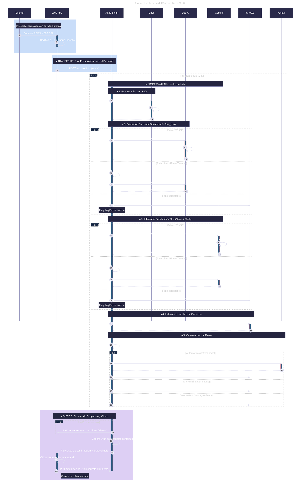
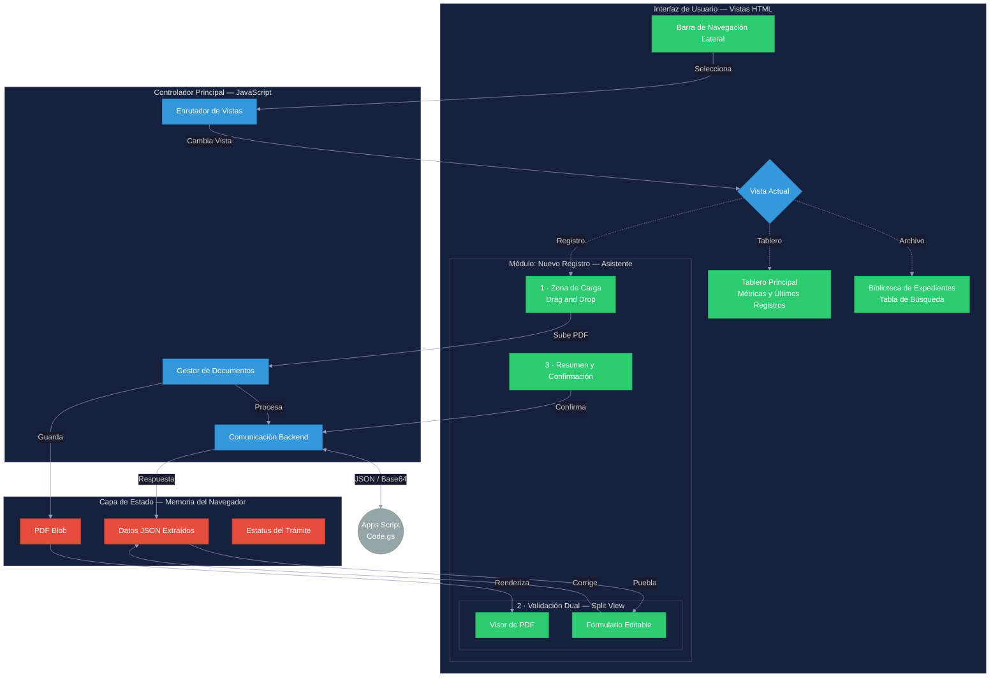

# 🚀 División de Servicios Administrativos (DSA)
### **Sistema de Gestión Documental Inteligente | Powered by Google AI**

---

## 📌 Descripción General
Este proyecto es un sistema avanzado de gestión y procesamiento de documentos (DSA) construido íntegramente sobre el ecosistema de **Google Workspace** y **Google Cloud**. Utiliza **Google Apps Script** como motor de orquestación, integrando capacidades forenses de **Document AI** y análisis semántico con **Gemini Flash** para transformar documentos físicos en datos estructurados y flujos de trabajo automatizados sin costos de servidor.

---

## 🛠️ Stack Tecnológico
| Capa | Tecnologías |
| :--- | :--- |
| **Runtime** | Google Apps Script (V8 Engine) |
| **Lenguaje** | TypeScript / JavaScript (ES2019+) |
| **Frontend** | HTML5, CSS3 (Vanilla/Tailwind), JS Moderno |
| **Persistencia** | Google Sheets (Libro de Gobierno) & Google Drive |
| **Inteligencia Artificial** | Document AI (OCR Forense) & Gemini 1.5 Flash (NLP) |
| **Comunicación** | Gmail API, `google.script.run` (Async RPC) |
| **Herramientas** | Clasp (Command Line Apps Script Projects) |

---

## 🏗️ Arquitectura Técnica
El sistema sigue un flujo asincrónico y resiliente para el procesamiento de documentos por lotes, garantizando la integridad de los datos mediante reintentos exponenciales y manejo de errores.

### **Diagrama de Secuencia de Procesamiento**

---

## 🎨 Arquitectura del Frontend (SPA)
La interfaz está diseñada como una **Single Page Application (SPA)** de alto rendimiento, optimizada para la interacción fluida y la gestión de estado local.

### **Estructura de la Interfaz y Flujo de Datos**

### **Componentes Clave del Frontend**
1.  **Capa de Estado**: Gestiona de forma reactiva los datos extraídos por la IA y los blobs de PDF para previsualización inmediata.
2.  **Validación Dual (Split View)**: Permite al usuario comparar el documento original (visado en PDF) contra los datos extraídos por Gemini, asegurando precisión forense.
3.  **Comunicación Asíncrona**: Utiliza el patrón `google.script.run` con manejadores de éxito/error para una experiencia sin recargas de página.

---

## ⚡ Estándares y Optimización
Para garantizar un rendimiento de nivel empresarial, el sistema implementa:

-   **Batching (Operaciones por Lotes)**: Minimización de llamadas a `SpreadsheetApp`. Las lecturas y escrituras se realizan en bloques (`getValues()` / `setValues()`) para evitar cuotas excesivas.
-   **Concurrency Control**: Uso de `LockService` para prevenir colisiones de datos durante escrituras simultáneas en el Libro de Gobierno.
-   **Seguridad**:
    -   Secrets gestionados vía `PropertiesService`.
    -   Estructura de archivos en Drive organizada dinámicamente por fecha (Año/Mes/Día).
    -   UUIDs únicos para cada expediente.
-   **Monitoreo**: Logs estructurados en JSON enviados directamente a Google Cloud Logging.

---

## 🚀 Instalación y Desarrollo
Este proyecto utiliza **Clasp** para el desarrollo local con TypeScript.

1.  **Clonar el repositorio** y entrar al directorio.
2.  **Instalar dependencias**: `npm install`.
3.  **Login en Google**: `clasp login`.
4.  **Enlazar proyecto**: `clasp create` o `clasp clone <SCRIPT_ID>`.
5.  **Desplegar**: `clasp push` para subir los cambios al entorno de Apps Script.

---

> [!IMPORTANT]
> El entorno de ejecución requiere que el motor V8 esté habilitado en `appsscript.json` para soportar la sintaxis moderna de JavaScript utilizada en el controlador y el backend.

---
© 2026 División de Servicios Administrativos (DSA) - Implementación de Vanguardia.
