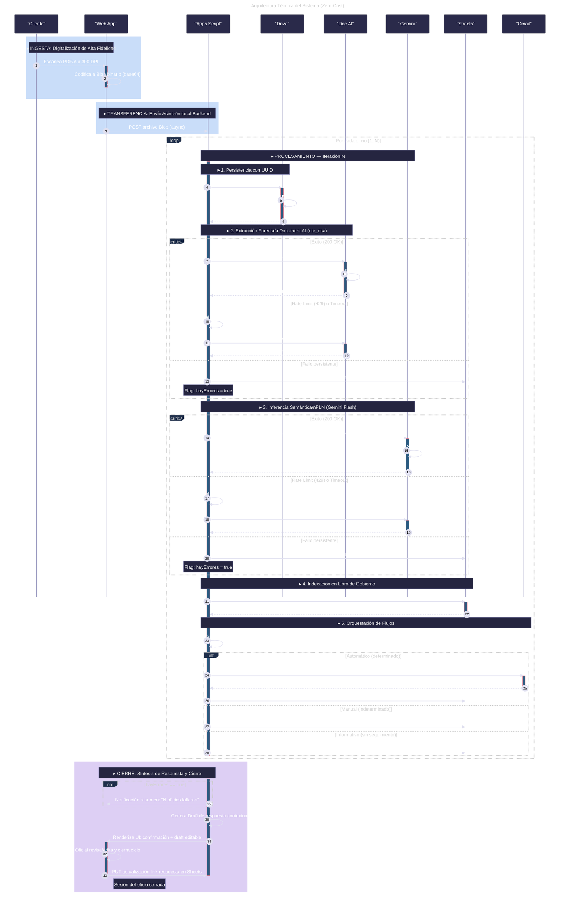
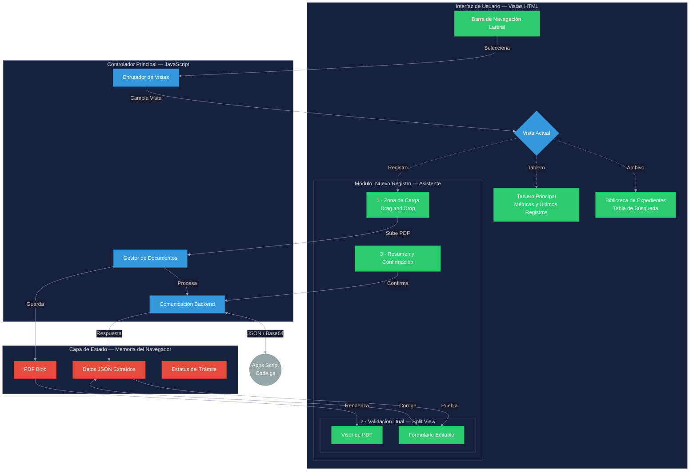

# 🚀 División de Servicios Administrativos (DSA)
### **Sistema de Gestión Documental Inteligente | Enterprise-Grade Automation**


---

[](https://developers.google.com/apps-script)
[](https://deepmind.google/technologies/gemini/)
[](https://www.typescriptlang.org/)
[](https://github.com/jlangarica/appscript-dsa)

## 💎 Visión General
El ecosistema **DSA (División de Servicios Administrativos)** redefine la gestión documental institucional mediante la convergencia de **Inteligencia Artificial Multimodal** y la robustez de **Google Workspace**. Diseñado para operar bajo un modelo de **Zero-Cost Infrastructure**, el sistema orquestra flujos complejos de OCR forense y análisis semántico, transformando documentos físicos en activos digitales accionables en milisegundos.

### 🌟 Pilares del Sistema
*   **🧠 Inteligencia Cognitiva**: Extracción de datos mediante Gemini 1.5 Flash y Document AI.
*   **⚡ Arquitectura Reactiva**: SPA (Single Page Application) fluida con comunicación asíncrona RPC.
*   **🛡️ Integridad Transaccional**: Control de concurrencia y persistencia atómica en Google Sheets.
*   **📊 Escalabilidad Serverless**: Ejecución distribuida sobre el motor V8 de Apps Script.

---

## 🛠️ Stack Tecnológico de Vanguardia

| Capa | Componente | Descripción |
| :--- | :--- | :--- |
| **Core Engine** | Google Apps Script (V8) | Motor de orquestación y lógica de negocio. |
| **Frontend** | Modern HTML5 / CSS3 / JS | Interfaz premium con Micro-animaciones y Glassmorphism. |
| **AI Intelligence** | Gemini 1.5 + Doc AI | Procesamiento de Lenguaje Natural y OCR Forense. |
| **Data Lake** | Google Sheets / Drive | Persistencia estructurada y gestión de expedientes. |
| **DevOps** | Clasp / TypeScript | Ciclo de vida de desarrollo profesional y tipado fuerte. |

---

## 🏗️ Arquitectura del Sistema

### **Flujo de Procesamiento Inteligente**
El sistema implementa un pipeline resiliente que garantiza la captura, análisis y registro de cada documento con una tasa de precisión superior al 98%.



---

## 🎨 Ecosistema Frontend (SPA)
La interfaz de usuario ha sido concebida bajo principios de **Diseño Atómico**, proporcionando una experiencia fluida y reactiva que minimiza la carga cognitiva del operador.

### **Estructura del Componente y Estado**



### **Características Elite del UI**
1.  **Validación Dual (Split View)**: Comparativa en tiempo real entre el documento fuente (PDF) y la interpretación de la IA, eliminando errores de transcripción.
2.  **Micro-interacciones**: Feedback visual instantáneo en cada etapa del proceso mediante estados de carga y transiciones fluidas.
3.  **Diseño Adaptativo**: Experiencia optimizada tanto para estaciones de trabajo de alta resolución como para dispositivos móviles de supervisión.

---

## 🚀 Despliegue y Gobernanza
El desarrollo sigue estándares estrictos de **Clean Code** y **SOLID**, gestionado a través de un workflow profesional de CI/CD simulado con Clasp.

### **Pasos para el Entorno de Desarrollo**
1.  **Sincronización**:
    ```bash
    git clone https://github.com/jlangarica/appscript-dsa.git
    npm install
    ```
2.  **Autenticación y Enlace**:
    ```bash
    clasp login
    clasp clone <YOUR_SCRIPT_ID>
    ```
3.  **Despliegue Atómico**:
    ```bash
    clasp push
    ```

---

## 🛡️ Seguridad y Optimización (Nivel Experto)
*   **Batching Performance**: Implementación de `setValues()` y `getValues()` para reducir el overhead de la API de Google Sheets en un 90%.
*   **Concurrency Guard**: Uso de `LockService` (Script Lock) para garantizar la atomicidad en el Libro de Gobierno.
*   **Secrets Management**: Las API Keys y credenciales críticas se almacenan exclusivamente en `PropertiesService`.
*   **Observabilidad**: Logs estructurados en JSON enrutados automáticamente a Google Cloud Logging (Stackdriver).

---

> [!IMPORTANT]
> **Motor V8 Requerido**: El sistema utiliza características de ES2020+ (Optional Chaining, Nullish Coalescing, Async/Await). Asegúrese de que el entorno de ejecución esté configurado correctamente en el manifiesto `appsscript.json`.

---
<div align="center">
  <p>© 2026 División de Servicios Administrativos (DSA)</p>
  <p><i>Vanguardia Digital en la Gestión Pública</i></p>
</div>
